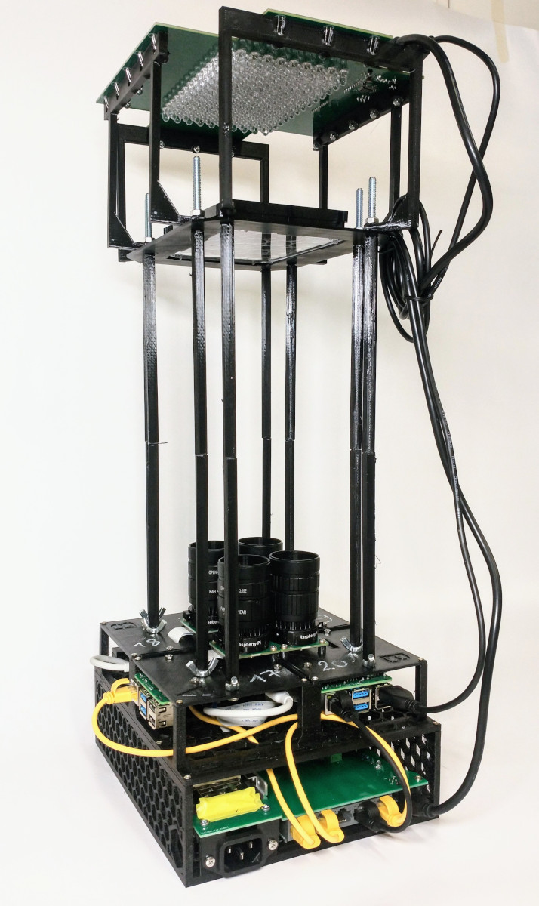

# Wormstation Client

_Wormsation Client_ is the client part of the _Wormstation_ project. 
See the main project repository [here](https://github.com/mmaatthieuu/Wormstation). 

Wormstation Client is a Python-based software designed to automate
the recording and processing of experiments involving worm behavior. 
It provides advanced functionalities for camera control, LED lighting, 
and file handling while integrating seamlessly with remote storage systems 
like NAS. The software is specifically designed for the _Wormstation_ project.

This software is made to be remotely controlled by the 
[_Wormstation Controller_](https://github.com/mmaatthieuu/wormstation_controller).

---

## Features

- **Camera Control:** Manage high-resolution recordings using the Raspberry Pi Camera.
- **LED Illumination:** Control IR, Orange, and Blue LEDs with configurable current levels and patterns.
- **Recording Scheduling:** Automate recordings with precise frame capture and interval settings.
- **Remote Storage:** Upload recordings to a NAS or remote server via SMB or SSH.
- **Log Management:** Comprehensive logging for debugging and monitoring.
- **Hardware Integration:** Seamlessly integrates with FT232H for SPI communication.
- **Monitoring Tools:** Monitor the recording processes and system status.

---

## Setup and Installation

### Requirements

#### Hardware:
- Raspberry Pi (tested on Raspberry Pi 4B)
- Raspberry Pi Camera
- FT232H USB to SPI bridge
- LP5860T-based LED drivers
- LEDs (IR, Orange, Blue)

#### Software:
- Raspberry Pi OS (Debian-based)
- Python 3.x

### Installation

1. Clone the repository:
   ```bash
   git clone https://github.com/mmaatthieuu/wormstation_client.git
   cd wormstation-client
   ```

2. Run the installation script:
   ```bash
   chmod +x INSTALL.sh
   ./INSTALL.sh
   ```

3. Follow the on-screen prompts to:
   - Install dependencies
   - Configure NAS credentials
   - Extend swap size
   - Add the user to necessary groups

4. Reboot the system to apply changes:
   ```bash
   sudo reboot
   ```

---

## Usage

### Starting the Program

To start the recording process, run the following command:
```bash
python3 cam.py <parameters_file.json>
```

### Parameters File

The program requires a JSON file with the following structure:
```json
{
  "verbosity_level": 3,
  "use_samba": true,
  "nas_server": "//192.168.1.100",
  "share_name": "wormstation",
  "credentials_file": "/etc/.smbpicreds",
  "smb_dir": "experiments",
  "recording_name": "experiment_01",
  "record_every_h": 1,
  "record_for_s": 3600,
  "timeout": 10800,
  "annotate_frames": true,
  "optogenetic": true,
  "optogenetic_color": "Blue",
  "pulse_duration": 1,
  "pulse_interval": 5
}
```

### Signal Handling
- **SIGTERM:** Stops the recording gracefully.
- **SIGUSR1:** Captures a frame during pause mode.

---

## Hardware Setup

### Overview



### Components
- Camera mounted above the experiment area.
- LEDs positioned to illuminate the setup.
- Raspberry Pi and FT232H for control.
- NAS or remote server for storage.

### Wiring
- FT232H connects to LED drivers via SPI.
- Camera connects to the Raspberry Pi camera port.

---

## Development

### Repository Structure

```
.
├── cam.py               # Main script
├── INSTALL.sh           # Installation script
├── README.md            # Documentation
├── src/
│   ├── cam_lib.py       # Camera library
│   ├── record.py        # Recording logic
│   ├── led_controller.py # LED control
│   ├── usb_handler.py   # USB handling
│   └── ...
├── parameters/          # Example parameter files
├── tests/               # Unit tests
└── wormstation_setup.jpg # Hardware setup image
```

### Contributing
1. Fork the repository.
2. Create a new branch:
   ```bash
   git checkout -b feature/your-feature-name
   ```
3. Commit your changes:
   ```bash
   git commit -m "Add your message here"
   ```
4. Push to the branch:
   ```bash
   git push origin feature/your-feature-name
   ```
5. Create a pull request.

---

## Troubleshooting

### Common Issues

1. **Camera Not Detected:**
   - Ensure the camera is connected securely.
   - Run `raspistill -v -o test.jpg` to verify the camera.

2. **NAS Upload Fails:**
   - Verify credentials in `/etc/.smbpicreds`.
   - Check NAS accessibility using:
     ```bash
     smbclient -L //<NAS_IP_ADDRESS> -U <username>
     ```

3. **FT232H Not Recognized:**
   - Verify udev rules in `/etc/udev/rules.d/99-ftdi.rules`.
   - Check dmesg logs:
     ```bash
     dmesg | grep FT232H
     ```

### Logs
Logs are saved locally and can be uploaded to the NAS. Adjust verbosity levels in the parameters file.

---

## License
This project is licensed under the MIT License. See the `LICENSE` file for details.

---

## Acknowledgments

Special thanks to all contributors and the open-source community for their invaluable tools and libraries.

